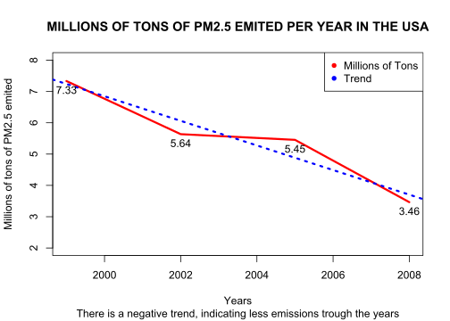
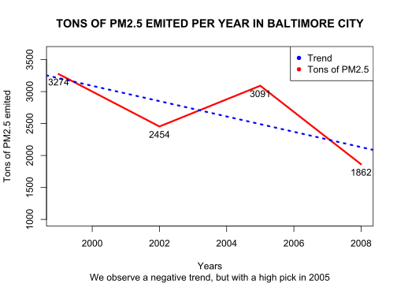
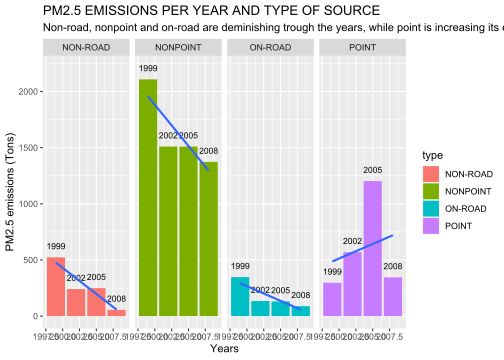
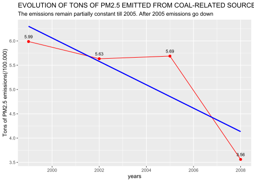
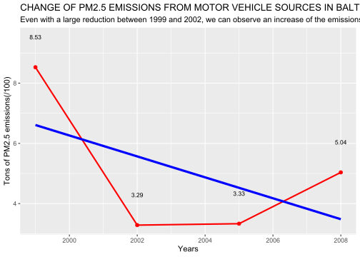
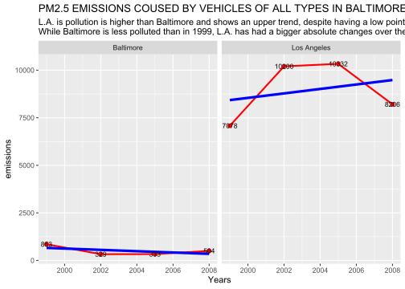

# Introduction

Exploratory analysis from the PM2.5 tons of particles emitted in the USA and it's evolution over time. Here it's been used the base plotting system of R plus ggplot2 package to build some graphics. The main goal of this was to train my manage of R language and tidyverse packages, in addition of some tools for data manipulation, like loops or text analysis function.

# Load and charge of the data


```r
urlzip <- "https://d396qusza40orc.cloudfront.net/exdata%2Fdata%2FNEI_data.zip"
destino <- paste(getwd(), "/data.zip", sep = "")
if (!file.exists(destino)){
    download.file(urlzip, destino)
    unzip(destino)
    }
list.files()
```

```
##  [1] "data.zip"                         "Plot1.png"                       
##  [3] "Plot1.R"                          "Plot2.png"                       
##  [5] "Plot2.R"                          "Plot3.png"                       
##  [7] "Plot3.R"                          "Plot4.png"                       
##  [9] "Plot4.R"                          "Plot5.png"                       
## [11] "Plot5.R"                          "Plot6.png"                       
## [13] "Plot6.R"                          "PM2.5_Exploratory_analisys.html" 
## [15] "PM2.5_Exploratory_analisys.md"    "PM2.5_Exploratory_analisys.Rmd"  
## [17] "PM2.5_Exploratory_analisys.Rproj" "PM2.5_Exploratory_analisys_cache"
## [19] "PM2.5_Exploratory_analisys_files" "README.md"                       
## [21] "Source_Classification_Code.rds"   "summarySCC_PM25.rds"
```

```r
pm2.5data <- readRDS("summarySCC_PM25.rds")
SCC <- readRDS("Source_Classification_Code.rds")

str(pm2.5data) 
```

```
## 'data.frame':	6497651 obs. of  6 variables:
##  $ fips     : chr  "09001" "09001" "09001" "09001" ...
##  $ SCC      : chr  "10100401" "10100404" "10100501" "10200401" ...
##  $ Pollutant: chr  "PM25-PRI" "PM25-PRI" "PM25-PRI" "PM25-PRI" ...
##  $ Emissions: num  15.714 234.178 0.128 2.036 0.388 ...
##  $ type     : chr  "POINT" "POINT" "POINT" "POINT" ...
##  $ year     : int  1999 1999 1999 1999 1999 1999 1999 1999 1999 1999 ...
```

```r
summary(pm2.5data)
```

```
##      fips               SCC             Pollutant           Emissions       
##  Length:6497651     Length:6497651     Length:6497651     Min.   :     0.0  
##  Class :character   Class :character   Class :character   1st Qu.:     0.0  
##  Mode  :character   Mode  :character   Mode  :character   Median :     0.0  
##                                                           Mean   :     3.4  
##                                                           3rd Qu.:     0.1  
##                                                           Max.   :646952.0  
##      type                year     
##  Length:6497651     Min.   :1999  
##  Class :character   1st Qu.:2002  
##  Mode  :character   Median :2005  
##                     Mean   :2004  
##                     3rd Qu.:2008  
##                     Max.   :2008
```

```r
sum(is.na(pm2.5data$Emissions)) # no missing data
```

```
## [1] 0
```

## Plot 1 - Total emisions from all sources per year

<!-- -->

## Plot 2 - Total emisions per year in the baltimore city

<!-- -->

## Plot 3 - Total emisions per year and type in the baltimore city

<!-- -->

## Plot 4 - Emissions from coal combustion-related sources

<!-- -->

## Plot 5 - Emissions from coal mothor vehicle sources in Baltimore City

<!-- -->

## Plot 6 - Emissions from coal mothor vehicle sources, Baltimore City VS Los Angeles City

<!-- -->
